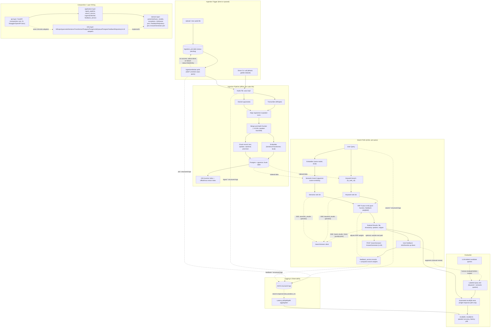

# Audio Search — Hybrid Retrieval Plan

## Core Engineering Principles (apply throughout implementation)
- Single Responsibility / SOLID: each class/function does one thing (domain/infra/application/api layering enforces this)
- Dependency Inversion: application code depends only on domain interfaces (ports), never on concrete infra
- KISS: prefer the direct/synchronous path by default; every stretch goal (job queue, SSE, feedback, LLM) stays optional and never complicates the core recall@k path
- YAGNI: no config/abstraction for scenarios outside the problem statement's scope
- DRY, but not premature: share pure functions (RRF fusion, chunking) across sync/streaming paths; don't abstract until a second real use case exists
- Explicit over implicit, no silent assumptions: validate inputs at system boundaries, fail fast with typed domain exceptions instead of guessing/defaulting
- Small, short, named functions over long procedural code, especially in chunking, RRF fusion, and ingestion stages
- Testability first: every application service constructible with fake/in-memory port implementations, no hidden global state
- Fail loud, log context: raise typed domain exceptions with stage/file id context rather than swallowing errors
- Security basics (OWASP-aware): parameterized SQL only, validate/sanitize user query text before logging or using in `ts_query`, never log secrets, credentials via env vars only
- Minimal dependencies: use stdlib/already-chosen stack (Postgres, FastAPI) before adding a new library

## Design Patterns for Extensibility / Modularity

Making explicit what the layered architecture already implies, so the
product stays extensible without rewrites as new requirements arrive:

- **Ports & Adapters (Hexagonal Architecture)**: the domain/infra split is
  this pattern — `Transcriber`, `Diarizer`, `Embedder`, `ChunkRepository`,
  `JobQueue`, `FeedbackRepository`, `AnswerGenerator` are all ports; infra
  provides adapters. Swapping Whisper for a hosted API, or pgvector for
  another vector store, means writing a new adapter — zero changes to
  application/domain code
- **Strategy pattern**: chunking strategy (merge-and-split) and fusion
  strategy (RRF) are isolated as swappable, pure functions/classes — e.g.
  RRF could be swapped for weighted-sum fusion without touching
  `search_service`'s orchestration logic
- **Repository pattern**: `ChunkRepository`, `AudioFileRepository`,
  `FeedbackRepository` abstract persistence — application code never writes
  raw SQL directly, only calls repository methods
- **Dependency Injection / Composition Root**: FastAPI's `Depends(...)` at
  the `api` layer is the single place concrete adapters are wired into
  application services — enables testing with fake adapters and swapping
  implementations without touching call sites
- **Factory (lightweight, implicit)**: the composition root (`api/main.py`
  or a `container.py`) assembles `ingest_pipeline`/`search_service` from
  concrete infra adapters — not a formal Factory class, kept minimal per YAGNI

### Why this matters for extensibility
- New audio formats, transcription providers, vector DBs, or fusion
  algorithms can be added as new adapters/strategies without modifying
  `domain` or `application` layers — only `infra` gains a new file and the
  composition root gains one wiring line
- Directly supports the stretch goals already planned (job queue, feedback,
  LLM) — each was designed as a new port + adapter, following the same
  pattern, not a special-cased addition

## Problem
Problem Statement 1: Effective Retrieval from Audio Transcripts — build hybrid
(keyword + semantic) search across 5-6 two-speaker audio conversations
(8-10 min each). Search must return file, timestamp, and speaker for each hit.
Evaluate with automated recall@k tests against a labeled query set.

## Constraints
- Tech stack: Python or TypeScript; RDBMS with embedding support (Postgres + pgvector)
- Embedding generation and indexing must run locally
- Transcription may be hosted or local
- Must disclose coding agent usage and how it was prompted
- Deliverables: design doc (Markdown/PDF), code + golden dataset + tests in a Git repo

## Architecture Decisions
- Single Postgres + pgvector (no Redis/Elasticsearch/microservices)
- Layered SOLID architecture:
  - domain: interfaces/models
    - ports (Protocols/ABCs): `Transcriber`, `Diarizer`, `Embedder`,
      `ChunkRepository`, `AudioFileRepository` — no implementation details
    - domain-specific exceptions (e.g. `TranscriptionFailedError`) so infra
      exceptions never leak past this layer
  - infra: Whisper (transcription), pyannote (diarization), SentenceTransformer
    (embeddings), Postgres adapters — each implements a domain port
  - application: ingest_pipeline, search_service — depends only on domain
    interfaces (ports), never imports infra modules directly; infra
    implementations are injected via constructor at the composition root
    - ingest_pipeline: idempotent per audio file (checksum/hash-based dedup);
      chunk save + vector write happen in a single Postgres transaction to
      avoid partial writes; structured logging per stage (transcribe/
      diarize/chunk/embed/index) with duration + counts for observability
      (see Logging & Observability section)
    - search_service: fuses keyword + semantic rank lists via a pure,
      unit-testable RRF function (no I/O); also exposes a streaming variant
      (see API Streaming section) for progressive result delivery, and
      applies feedback-derived branch weights (see Relevance Feedback Loop)
  - api: thin FastAPI layer — the composition root; the only place that
    imports both `infra.*` and `application.*`, wires concrete adapters into
    application services via DI (`Depends(get_search_service)`), maps domain
    exceptions to HTTP status codes, reads config from an env-backed Settings
    object injected at startup (never read directly inside application services)
- Chunking: merge-and-split turn-aligned strategy
  - Merge consecutive short turns from the same speaker until ~15-30s target
    reached; never cross a speaker boundary
  - Split long single-speaker turns at sentence/pause boundaries into
    sub-chunks capped at ~30-45s, with ~2-3s overlap to avoid cutting
    semantic units
  - Store prev/next chunk ID per chunk for query-time context stitching
    (display ±1 chunk around a highlighted result)
- Fusion: Reciprocal Rank Fusion (RRF, k=60) combining:
  - keyword rank list (Postgres `ts_rank_cd`)
  - semantic rank list (pgvector cosine similarity)
- Ingestion execution model: direct/synchronous by default (suitable for the
  5-6 file golden dataset); optional Postgres-backed job queue described
  below as a production-readiness stretch goal
- Async usage: `search_service.search()` and `ingest_pipeline.run()` are
  implemented as `async def` for I/O efficiency (DB queries, embedding
  calls), but each is still a single await -> single response contract;
  only `search_stream()` (see API Streaming) yields multiple events over
  time. "Async" (non-blocking I/O) and "streaming" (multi-event delivery)
  are independent concerns here — evaluation only ever depends on the
  single-response contract, never the multi-event one
- No LLM in the core retrieval path (transcription/diarization/embedding are
  all non-generative); LLM usage is limited to optional stretch layers (see
  LLM Integration section) that sit outside the recall@k-evaluated path

## Logging & Observability

Structured (JSON) logging via Python stdlib `logging`, configured once at
the composition root — no heavy APM/tracing stack needed for this scope.

### What to log
- Ingestion pipeline (per stage, per audio file): `ingest.transcribe.start/end`,
  `ingest.diarize.start/end`, `ingest.chunk.end`, `ingest.embed.end`,
  `ingest.index.end` — each with `audio_file_id`, `duration_ms`, and stage-
  specific counts (segment_count, speaker_count, chunk_count); `ingest.failed`
  with `stage`, `error_type`, `error_message` on domain exceptions
- Search path: `search.request` (query_text/hash, query_type, top_k),
  `search.keyword_branch.end` / `search.semantic_branch.end` /
  `search.fusion.end` (duration_ms, result_count each), `search.response`
  (total_duration_ms, top_result_score)
- Job queue/worker (if implemented): `job.claimed/done/failed` (job_id, attempts)
- Feedback (if implemented): `feedback.recorded` (query_text, chunk_id, signal)

### Log levels
- `INFO`: stage start/end events, request/response summaries
- `WARNING`: retried operations, degraded results (e.g. empty branch)
- `ERROR`: pipeline/search failures with `error_type`/`error_message`
- `DEBUG`: raw query text, full result sets (opt-in via env var, off by default)

### Where this fits architecturally
- Logging calls live in the `application` layer (ingest_pipeline,
  search_service) at stage boundaries, where duration/counts are naturally
  available — no new domain port needed; logging is cross-cutting, not a
  swappable dependency
- Log level / format / output destination read once from the env-backed
  `Settings` object at the composition root, consistent with other config

### Reuse for Evaluation Plan latency measurement
- `search.response` events already carry `total_duration_ms` per query, so
  Evaluation Plan §4 (Latency) can compute p50/p95/p99 by aggregating
  structured log output across the labeled query set run, instead of
  separate ad hoc timing code

## API Documentation — Swagger/OpenAPI

FastAPI generates OpenAPI/Swagger docs automatically from route type hints
and Pydantic models — no extra dependency needed, just disciplined typing.

### Pydantic request/response models
- `SearchResultItem` (chunk_id, file_name, start_time, end_time, speaker_id,
  text_snippet, score)
- `SearchResponse` (query, results: list[SearchResultItem], took_ms)
- `IngestRequest` / `IngestResult` (audio_file_path, chunk_count, duration_ms)
- `FeedbackRequest` (query_text, chunk_id, signal) — if feedback loop implemented
- `AnswerResponse` (answer_text, cited_chunks) — for optional `/search/answer`

### App-level and route-level documentation
- `FastAPI(title=..., description=..., version=...)` set in the composition
  root (`api/main.py`) so `/docs` (Swagger UI) and `/redoc` show project info
- Each route decorated with `response_model`, `summary`, `description`, and
  a `tags=[...]` grouping (`search`, `ingest`, `feedback`, `admin`)
- Example values added via `Field(..., examples=[...])` on key models so
  Swagger UI's "Try it out" is immediately usable without prior setup

### Endpoints to document
`GET /search`, `GET /search/stream` (SSE, optional), `POST /ingest` (or
CLI-only if kept out of the API), `POST /search/feedback` (optional),
`POST /search/answer` (optional)

### Why this matters
- Zero-extra-dependency way for evaluators/graders to interactively try the
  API without a separate frontend
- Documents the API contract precisely, complementing SOLUTION.md

## Data Model — Chunk

| Field | Purpose |
|---|---|
| `chunk_id` | Primary key (UUID) |
| `audio_file_id` | FK to source file |
| `speaker_id` | Which of the 2 diarized speakers uttered this (e.g. `SPEAKER_00`) |
| `text` | Transcribed text of the chunk (merged/split from Whisper segments) |
| `start_time` / `end_time` | Timestamps (seconds) into the audio file — needed for playback/highlighting |
| `embedding` | Vector (pgvector column) from SentenceTransformer, computed on `text` |
| `prev_chunk_id` / `next_chunk_id` | Query-time context stitching (show ±1 chunk around a hit) |
| `token_count` / `char_count` | Chunking QA / debugging merge-split logic |
| `created_at` | Ingestion timestamp, for auditing/idempotency checks |
| `tsvector` (generated column) | Postgres full-text search vector on `text`, GIN-indexed for `ts_rank_cd` |

Joined via `audio_file_id` to the `audio_file` table for `file_name`/`file_path`
(needed to satisfy "return the containing file" requirement).

## LLM Integration (optional, outside the core retrieval path)

No LLM/generative model is used for transcription, diarization, embedding,
or the core recall@k-evaluated search path. Two optional integration points:

### 1. Answer generation (RAG-style, additive on top of search results)
- New endpoint `POST /search/answer` — takes the top-k fused chunks
  (already carrying file/speaker/timestamp metadata) as context, asks an
  LLM to produce a natural-language answer citing which file/speaker/
  timestamp it came from
- New domain port `AnswerGenerator` (`generate(query, chunks) -> Answer`),
  infra adapter calls a local or hosted LLM
- Fully separate from `search_service.search()` — does not affect recall@k
  evaluation, latency success criteria, or the core ranked-results contract

### 2. LLM-assisted labeled query set generation (offline tooling, not runtime)
- An LLM can draft candidate keyword/semantic queries and plausible
  ground-truth `chunk_id` matches from each transcript, which a human then
  reviews/corrects before it's added to the golden query set (Evaluation
  Plan §2)
- Purely an authoring aid for building the evaluation dataset faster — not
  part of the served system, and every LLM-suggested label is human-verified
  before being trusted as ground truth

### Why not use an LLM in the core retrieval path
- Query expansion/rewriting and cross-encoder re-ranking were considered
  but rejected for this scope — both add latency that risks violating the
  p95 < 500ms success criterion, and the problem statement's core
  deliverable is retrieval quality (recall@k), not generation quality
- Keeps the evaluated path (`search_service.search()`) fully deterministic
  and free of LLM-induced variance

## Production Considerations — Postgres Job Queue (stretch goal, optional)

Default ingestion is direct/synchronous (one function call per audio file,
suitable for the 5-6 file golden dataset). For production scale, an optional
`ingestion_job` table with `SKIP LOCKED` polling can decouple upload from
processing without adding new infra (no Redis/Celery — reuses the existing
Postgres instance).

### Schema: `ingestion_job`

| Field | Purpose |
|---|---|
| `job_id` | PK (UUID) |
| `audio_file_path` | Path/URI to source audio |
| `status` | `pending` \| `processing` \| `done` \| `failed` |
| `attempts` | Retry counter |
| `last_error` | Last failure message (for debugging) |
| `locked_by` | Worker ID currently processing (nullable) |
| `locked_at` | Timestamp lock acquired (for stale-lock detection/timeout) |
| `created_at` / `updated_at` | Auditing |

### Claim query (worker polling loop)

```sql
UPDATE ingestion_job
SET status = 'processing', locked_by = $1, locked_at = now(), attempts = attempts + 1
WHERE job_id = (
  SELECT job_id FROM ingestion_job
  WHERE status = 'pending'
     OR (status = 'processing' AND locked_at < now() - interval '10 minutes')
  ORDER BY created_at
  FOR UPDATE SKIP LOCKED
  LIMIT 1
)
RETURNING *;
```

`SKIP LOCKED` lets multiple worker processes poll concurrently without
blocking on each other's row locks — each worker atomically claims a
different pending job.

### Worker loop (new `IngestionWorker`, application layer)
1. Poll the claim query on an interval (or use `LISTEN/NOTIFY` for push-based
   wakeup instead of polling).
2. On claim, run the existing `ingest_pipeline.run(audio_file_path)`
   (unchanged — reuses the domain-interface-based pipeline already designed).
3. On success: `UPDATE ... SET status='done'`. On exception:
   `UPDATE ... SET status='failed', last_error=...` (or reset to `pending`
   if `attempts < max_retries` for automatic retry).

### Why this fits the existing architecture
- No new infra dependency — reuses the single Postgres instance.
- `ingest_pipeline` application service is unchanged; only a new thin `infra`
  adapter (`PostgresJobQueue` implementing a new `JobQueue` domain port) and
  a worker entrypoint script are added.
- Layered on top of the direct/synchronous path as an optional enhancement,
  not a replacement — the direct path still works for one-off golden-dataset
  ingestion via CLI.

## API Streaming — Search via SSE (stretch goal, optional)

Keyword and semantic branches don't finish at the same time (keyword is a
direct DB query; semantic requires an embedding call first). SSE lets a
client start rendering partial results as soon as each branch is ready,
instead of blocking until the fully fused result set is available.

### Endpoint
- `GET /search/stream?q={query}` — returns `text/event-stream` instead of a
  single JSON response; existing synchronous `GET /search?q=...` endpoint is
  kept unchanged (used by the recall@k evaluation suite, which needs a
  single deterministic final result, not a stream)

### Event sequence
1. `event: keyword_results` — emitted as soon as the keyword branch
   (`ts_rank_cd`) resolves (typically fastest, pure DB query)
2. `event: semantic_results` — emitted once embedding + pgvector cosine
   search resolves
3. `event: fused_results` — emitted once RRF fusion combines both branches
   into final ranked results; this is the event a client should treat as
   "ready to accept" (final, orderable result set)
4. `event: done` — signals stream completion (or `error` event on failure)

### `search_service` change
- Add `search_stream(query) -> AsyncIterator[SearchEvent]` alongside the
  existing `search(query)` (both `async def`) — both reuse the same
  underlying keyword/semantic/RRF pure functions; only the orchestration
  differs (yield-as-ready vs. return-all-at-once). `async`/`await` here is
  purely for non-blocking I/O (DB + embedding calls); it is orthogonal to
  whether the caller gets one response or a stream of events

### API layer (composition root)
- FastAPI `StreamingResponse` (or `sse-starlette` for typed SSE events)
  wraps `search_service.search_stream(query)`, formatting each event as
  `data: {...}\n\n`

### Client "accept" behavior
- Consumers should only treat `fused_results` (or `done`) as the point where
  the result set is final and correctness-relevant; earlier partial events
  (`keyword_results`, `semantic_results`) are optimistic previews only

## Relevance Feedback Loop (stretch goal, optional)

Goal: let user signal (clicked result, thumbs up/down) inform future
ranking, without retraining the embedding model (out of scope for a
local/offline, hackathon-scoped system).

### Schema: `search_feedback`

| Field | Purpose |
|---|---|
| `feedback_id` | PK (UUID) |
| `query_text` | Raw query string submitted |
| `chunk_id` | Which result the feedback applies to |
| `rank_shown` | Position it appeared at when feedback was given (for bias correction) |
| `signal` | `click` \| `thumbs_up` \| `thumbs_down` \| `dwell_time_ms` |
| `created_at` | Timestamp |

### How feedback improves ranking (without retraining)
1. **RRF weight tuning**: aggregate feedback per `query_type` (keyword vs
   semantic) to see which branch's results get more positive signal; adjust
   the RRF weighting (currently equal-weighted k=60 for both lists) — e.g.,
   if semantic-branch results are clicked more often for certain query
   patterns, bias fusion toward it
2. **Negative filtering**: repeatedly down-voted chunks for a given query
   pattern can be demoted (small rank penalty) on subsequent searches of
   similar queries — simple frequency-based rule, not a learned model
3. **Query-set augmentation for eval**: clicked/thumbs-up (query, chunk)
   pairs become new candidate entries for the labeled query set (see
   Evaluation Plan) after manual review — grows the golden eval set over
   time from real usage instead of only manual curation

### Why not fine-tune the embedding model
- Out of scope for a hackathon-scoped, locally-run system — fine-tuning
  SentenceTransformer would need a labeled contrastive dataset far larger
  than what 5-6 files + feedback could produce
- Keeps the pure/stateless RRF fusion function testable — feedback-driven
  weight adjustments are applied as a small config layer on top, not baked
  into the model

### Where this fits architecturally
- New `FeedbackRepository` domain port + Postgres adapter (same DB, no new infra)
- New `feedback_service` application service: `record_feedback(...)`,
  `get_branch_weights(query_type)` (used by `search_service` to adjust RRF
  fusion weights)
- API: `POST /search/feedback` endpoint (composition root wires it same as
  `search_service`)

### Limitation to state explicitly in SOLUTION.md
With only 5-6 files and a small query set, there won't be enough feedback
volume during the hackathon window to meaningfully shift rankings — this is
a designed-for-production mechanism, not something demonstrated with real
usage data in this submission.

## Flow Diagram



## Evaluation Plan

### 1. Chunking Quality (pre-retrieval sanity checks)
- Speaker-purity check: automated assertion that no chunk's text spans two
  diarized speaker turns (should hold by construction; regression-tested
  against pyannote output)
- Length distribution: histogram of `char_count`/`token_count` per chunk;
  flag outliers (near-empty chunks, or chunks hard-split at the 45s cap)
- Boundary sanity: spot-check a sample of `start_time`/`end_time` values
  against the source audio to confirm no drift from merge-split logic

### 2. Retrieval Quality (core evaluation — recall@k)
- Labeled query set: 15-20 queries per audio file, split into:
  - keyword queries (exact phrases/named entities verifiable via transcript grep)
  - semantic queries (paraphrases/conceptual questions not using exact wording)
  - each labeled with ground-truth relevant `chunk_id`s from manual transcript
    review (optionally LLM-drafted first, always human-verified — see LLM
    Integration section)
- Metrics (aggregated overall and split by `query_type`):
  - `recall@5`, `recall@10`
  - `MRR` (mean reciprocal rank) as a secondary metric, to catch relevant
    results buried near rank 9-10 even when recall@10 passes
- Automated test: pytest (with `pytest-asyncio` since `search_service.search()`
  is `async def`) loads the labeled query set, awaits each query through
  `search_service.search()` — the single-response path, never
  `search_stream()` — computes recall@k, asserts against success criteria
  thresholds (recall@5 >= 0.80, recall@10 >= 0.90). Async is used here only
  for non-blocking I/O; each test still asserts on one complete result set
  per query, not a sequence of streamed events

### 3. Speaker Attribution Accuracy
- Compare predicted `speaker_id` per result against manually verified
  ground-truth speaker labels on a sample
- Metric: % of top-k results with correct speaker label

### 4. Latency
- Measure end-to-end `search_service.search(query)` wall-clock time
  (embedding + both branches + RRF fusion) across the labeled query set
- Report p50/p95/p99 on a warmed-up system (excludes model-loading cold
  start); assert p95 < 500ms. Computed by aggregating structured
  `search.response` log events (see Logging & Observability) instead of
  separate ad hoc timing code

### 5. Failure-mode analysis (qualitative)
- For queries below threshold, manually classify root cause: chunking
  (relevant text split across chunks), embedding (query too abstract), or
  fusion (RRF weighting favored the wrong branch)
- Document 2-3 representative failure cases with root cause in SOLUTION.md

## Success Criteria
- recall@5 >= 0.80
- recall@10 >= 0.90
- (measured separately for query_type = keyword vs semantic)
- speaker attribution accuracy >= 0.90
- search latency p95 < 500ms

## Tasks
1. Source golden dataset: 5-6 audio files, 8-10 min, unique speaker pairs
   (interviews/podcasts)
2. Scaffold repo structure: src/domain, src/infra, src/application, src/api,
   db/schema.sql, docker-compose.yml
3. Implement ingestion pipeline: transcription -> diarization -> chunking ->
   embedding -> indexing into Postgres/pgvector
4. Implement hybrid search service: keyword query + semantic query -> RRF fusion
   -> ranked results with file, timestamp, speaker highlighting
5. Build labeled query set (keyword + semantic queries with expected relevant
   chunks) for evaluation
6. Implement automated recall@k evaluation tests (async single-response path)
7. Implement chunking QA checks (speaker-purity, length distribution,
   boundary sanity) as automated regression tests
8. Implement speaker attribution accuracy and latency (p50/p95/p99)
   measurement scripts
9. Conduct failure-mode analysis on queries below threshold; document
   representative cases
10. Write up SOLUTION.md: design rationale, success criteria, results
    achieved, limitations
11. Write AGENT_LOG.md: disclosure of coding agent prompts/responses used
    throughout development
12. (Optional/stretch) Implement Postgres-backed `ingestion_job` queue with
    `SKIP LOCKED` polling for production-scale ingestion
13. (Optional/stretch) Implement `/search/stream` SSE endpoint for
    progressive keyword/semantic/fused result delivery
14. (Optional/stretch) Implement `search_feedback` table + `feedback_service`
    to record user signal and adjust RRF branch weights over time
15. (Optional/stretch) Implement `POST /search/answer` LLM answer-generation
    endpoint on top of existing search results; use an LLM to draft
    candidate labeled-query-set entries for human review
16. Add Pydantic request/response models, route metadata (summary,
    description, tags, examples), and FastAPI app metadata so Swagger UI
    (`/docs`) and ReDoc (`/redoc`) are fully usable for demoing the API
17. Implement structured (JSON) logging across ingestion pipeline, search
    path, and (if built) job queue/feedback services; wire latency
    measurement (Evaluation Plan §4) to aggregate `search.response` log events
18. Maintain PROGRESS.md as a living status file mirroring this Tasks list
    1:1 under "Done" / "Not Done" sections, updated as each task completes

## Implementation Phasing (Phase 1-4)

| Phase | Scope | Tasks |
|---|---|---|
| Phase 1 — Foundation | Golden dataset sourcing, repo scaffold (domain/infra/application/api), DB schema + docker-compose, domain ports defined | 1, 2 |
| Phase 2 — Core Pipeline | Ingestion pipeline (transcribe->diarize->chunk->embed->index), hybrid search service with RRF fusion, first-pass recall@k tests against a placeholder query set | 3, 4, 6 |
| Phase 3 — Evaluation & Quality Hardening | Real labeled query set, chunking QA checks, speaker accuracy + latency measurement, failure-mode analysis, structured logging, Swagger/OpenAPI docs | 5, 7, 8, 9, 16, 17 |
| Phase 4 — Write-up & Stretch Goals | SOLUTION.md, AGENT_LOG.md, PROGRESS.md maintenance, and optional stretch items (job queue, SSE, feedback loop, LLM integration) if time permits | 10, 11, 18, 12-15 (optional) |

Each phase is independently demoable: Phase 2 alone already satisfies the
core problem statement (search returns file/timestamp/speaker); Phase 3 is
what makes it evaluated; Phase 4 is polish + disclosure.

## Agent Context Management & Compression Strategy

Since this project is built with coding-agent assistance across multiple
sessions, and the submission requires disclosing how the agent was
directed, context is managed deliberately rather than replaying full chat
history each time:

1. One phase = one agent session. Start each phase's session by pointing
   the agent only at the relevant plan section(s) (e.g. "read Architecture
   Decisions and Data Model, then implement Phase 2 Task 3") — not the
   entire plan file, keeping the agent's working context small and focused.
2. PROGRESS.md is the compressed state handoff. Instead of re-explaining
   prior decisions at the start of a new session, the agent reads
   PROGRESS.md's "Done" section — kept short (task-level, not
   conversation-level) so it acts as compressed context.
3. End-of-session carry-forward summary. Before closing a session, ask the
   agent to produce a short summary: decisions made, files touched,
   deviations from the plan, open TODOs. This seeds the next session and
   feeds directly into AGENT_LOG.md, avoiding the need to scroll back
   through long chat transcripts.
4. AGENT_LOG.md structure (satisfies the "disclosure of coding agent use"
   submission requirement):
   ```
   ## Phase N — <date>
   Prompt summary: <what was asked>
   Key agent decisions: <bullet list>
   Deviations from plan.md: <if any, with rationale>
   Files touched: <list>
   ```
5. Don't re-paste full plan/code in every prompt. Reference file paths and
   section headers by name; let the agent read the actual files rather than
   re-pasting content into chat — keeps prompts short and avoids context
   window pressure over the multi-day build.

## Status (as of 2026-09-23)
Design docs already drafted (SOLUTION.md, PROBLEM_STATEMENT_DETAILED.md,
EVALUATION.md, PROGRESS.md, SESSION.md, PROJECT_CONTEXT.md). No implementation
code exists yet. No golden dataset sourced yet. AGENT_LOG.md not yet created.
PROGRESS.md should be updated to track Tasks 1-18 above under "Done"/"Not Done".

## Open Questions / Refinement Needed
- Which specific audio sources to use for the golden dataset (copyright-safe)?
- Exact labeled query set size and construction method (manual vs LLM-assisted)?
- Whisper model size / local vs API tradeoff for transcription?
- pyannote model choice and license considerations for diarization?
